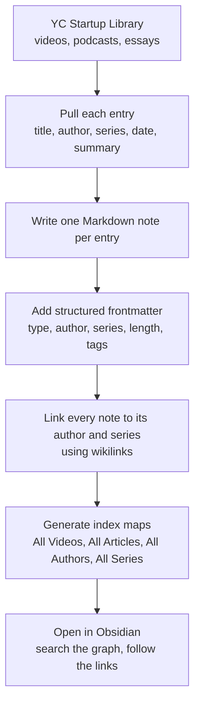
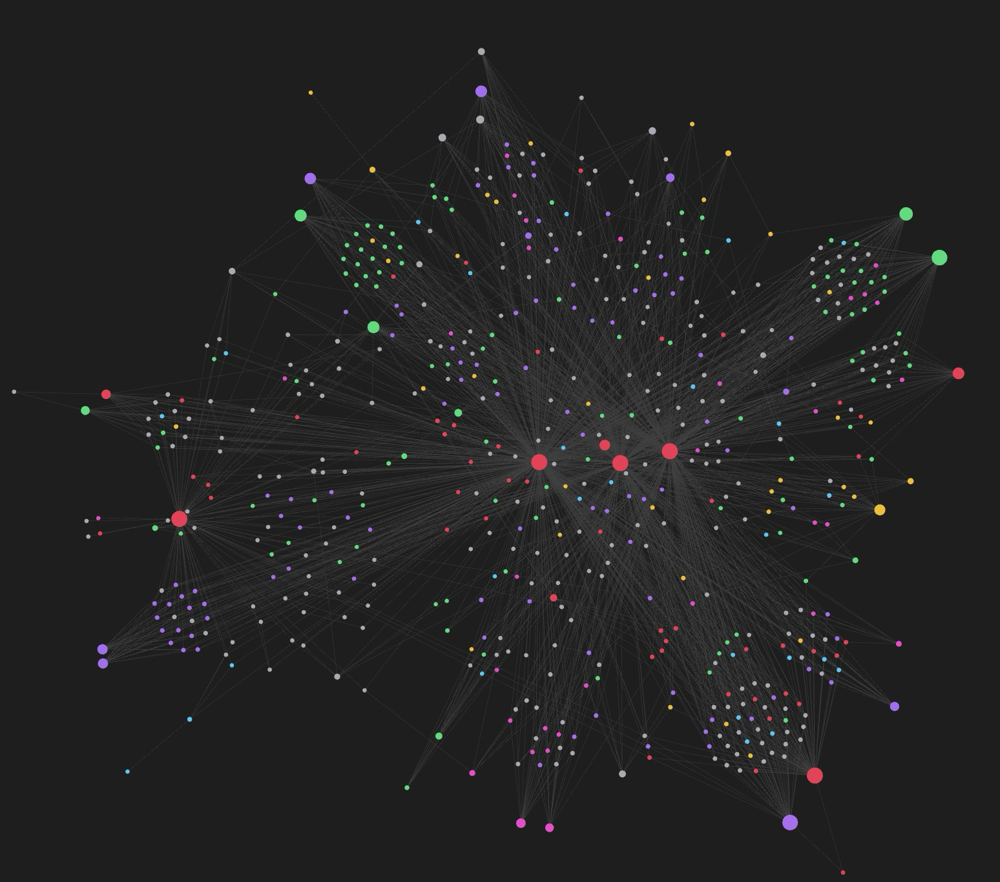
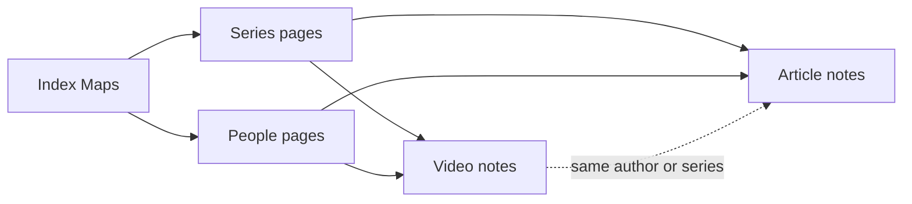

# YC Knowledge Base

This is a personal second brain I built from the entire [Y Combinator Startup Library](https://www.ycombinator.com/library). Basically, I took every talk, podcast, and essay in the library and turned each one into a single linked note. So instead of decades of startup advice being scattered across hundreds of videos and articles out there, it all lives in one place: one searchable, connected graph.

This repo is the structure of that brain. It shows how it was built and what it gets used for. The full transcripts aren't included (see [A note on the content](#a-note-on-the-content)), but every note, link, author, and series is here, so you can see exactly how the system is wired together.

---

## At a glance

| | |
|---|---|
| Entries | **466** (366 videos, 100 articles) |
| Authors and speakers | **110** |
| Series and shows | **24** |
| Notes in the graph | **604** |
| Source | [Y Combinator Startup Library](https://www.ycombinator.com/library) |
| Tool | [Obsidian](https://obsidian.md) (plain Markdown, no lock-in) |

---

## Two ways to read this repo

**If you're a non-technical builder:** start with [How I use it](docs/how-i-use-it.md). That's really the whole point of all of this. When you're building something and you hit a real decision, you don't want to vaguely remember that some YC partner once said something useful. You want to find it in ten seconds, read it, and see who said it and where. And that's exactly what this brain does. You don't need to know how I built it to get the idea.

**If you're a technical builder:** start with [How it was built](docs/how-it-was-built.md) and [Anatomy of a note](docs/anatomy-of-a-note.md). The interesting part is the data model, and it's pretty simple: one Markdown file per entry, structured frontmatter on every field, wikilinks that connect each entry to its author and its series, and generated index maps that turn the whole thing into a graph you can actually walk. No database, no app, just files.

Both paths land on the same idea. A pile of great advice isn't really useful until it's structured, and this is just one way to structure it.

---

## What's inside

```
yc-knowledge-base/
├── README.md                 You are here.
├── docs/
│   ├── how-it-was-built.md    The build process, start to finish.
│   ├── how-i-use-it.md        What this brain is actually for.
│   └── anatomy-of-a-note.md   The schema behind every note.
└── vault/                    The brain itself. Open this folder in Obsidian.
    ├── README.md              The home map of the vault.
    ├── Videos/                366 talk and podcast notes.
    ├── Articles/              100 essay and guide notes.
    ├── People/                110 author pages, each listing their work.
    ├── Series/                24 series pages (Lightcone, Dalton & Michael, etc).
    └── _maps/                 Generated index maps across the whole library.
```

The `vault/` folder is a real Obsidian vault. Clone the repo, open that folder in Obsidian, and the whole thing comes alive: full-text search across everything, a visual graph of how every author and series connects, and one click from any talk to the person who gave it or the series it belongs to.

---

## How it was built, in one picture



If you want the full breakdown, it's all in [How it was built](docs/how-it-was-built.md).

---

## See it in action

The vault opens up as a live graph in Obsidian. Below, I colored the graph by the six decision areas I actually use it for. The grey nodes are the author and series pages, which are basically the spine that holds everything together. And the colored nodes are the talks and essays that speak to a specific decision, so when a real choice comes up, the sources I need all light up together.

<!-- Save your screenshot as docs/images/graph-view.png and it appears here automatically. -->


**Reading the colors:**

| Color | Decision area |
|---|---|
| Red | Getting into YC |
| Amber | Pricing and business model |
| Green | Fundraising and investors |
| Pink | Talking to users |
| Blue | Growth and distribution |
| Purple | Team, hiring, and cofounders |
| Grey | Author and series pages (the connective spine) |

---

## How the pieces connect

Every entry is linked to the person who made it and the series it belongs to. People pages list everything that person has in the library. Series pages list every entry in that series. And the index maps sit on top and tie it all together. The result is simply a graph you can walk in any direction.



---

## A note on the content

All of the source material belongs to Y Combinator and the individual authors and speakers. It all comes from the [Y Combinator Startup Library](https://www.ycombinator.com/library).

What's in this repo is the **structure** of the knowledge base: every note's title, its metadata, its short summary, the author and series links, and the index maps. It does **not** include the full video transcripts or the full text of the articles. Every note keeps a link back to its original source, so the credit and the real material always point home.

And if you find this useful, go watch and read the originals over at the [YC Startup Library](https://www.ycombinator.com/library). That's where the actual value lives. This repo is simply a map of it, not a copy of it.

---

## Explore it yourself

1. Clone the repo: `git clone <this repo>`
2. Install [Obsidian](https://obsidian.md) (it's free).
3. In Obsidian, choose "Open folder as vault" and pick the `vault/` folder.
4. Open the graph view and the home map (`vault/README.md`), then just start clicking.

You can also just browse the Markdown files right here on GitHub. Start with [`vault/README.md`](vault/README.md).

---

## Why I built this

I'm a solo founder and business owner. The YC Startup Library is one of the best free collections of startup advice that exists out there, but it's spread across hundreds of hours of video and dozens of essays, and none of it is connected. When I'm making a real decision, I don't want to scrub through a two hour podcast hoping to re-find the thing I half-remember. I want to ask a question, get the handful of sources that actually speak to it, and see who said what and where.

So I built the brain that does exactly that. And this repo is simply how it works and what I use it for.
