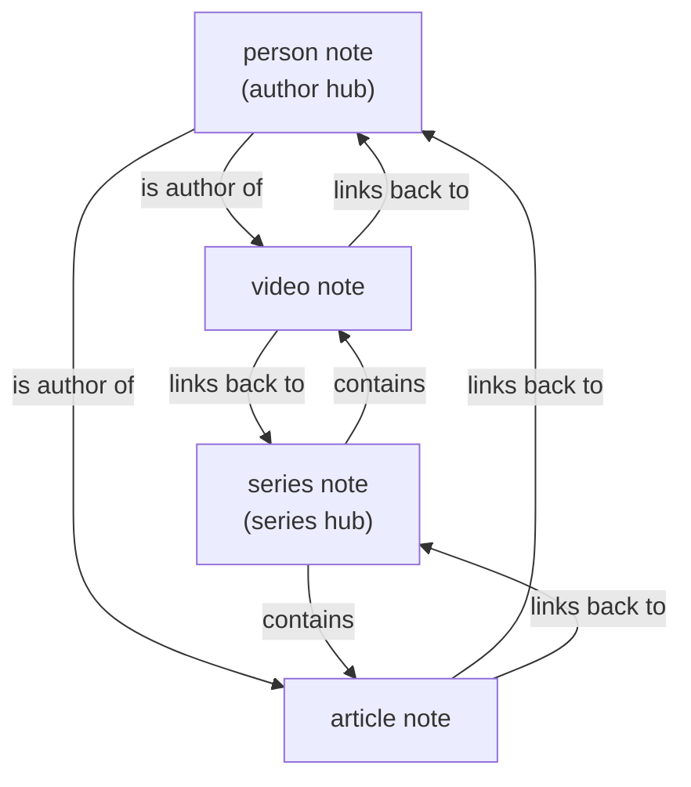

# Anatomy of a note

Every note in this vault follows the exact same shape, and that sameness is the whole reason the library is queryable at all. This page breaks down each of the four note types, so the schema is fully visible.

There are four types in total: **video**, **article**, **person**, and **series**. The `type` field in the frontmatter is what tells you which one a given note is.

---

## 1. Video note

A talk, podcast episode, or course session. This is the most detailed type of the four.

```markdown
---
title: Agents For Non-Technical Users
type: video
source: YC Library
url: "https://www.ycombinator.com/library/NN-agents-for-non-technical-users"
author: Y Combinator
series: Lightcone Podcast
youtube_id: 8SVocWnDHwE
youtube_url: "https://www.youtube.com/watch?v=8SVocWnDHwE"
upload_date: 2026-03-16
length: "39:32"
views: 47169
has_transcript: true
tags:
  - yc-library
  - video
  - series/lightcone-podcast
---

# Agents For Non-Technical Users

**Author:** [[Y Combinator]]
**Series:** [[Lightcone Podcast]]
**Video:** [Watch on YouTube](https://www.youtube.com/watch?v=8SVocWnDHwE)
**Length:** 39:32
**Uploaded:** 2026-03-16
**Source:** [YC Library](https://www.ycombinator.com/library/NN-agents-for-non-technical-users)

## Summary
A short description of what the talk covers.

## YouTube Description
The original description, including chapter timestamps.
```

### Field reference

| Field | Meaning |
|---|---|
| `title` | The entry title. |
| `type` | Always `video` here. |
| `source` | Where it came from (YC Library). |
| `url` | The canonical page on ycombinator.com. |
| `author` | The speaker or channel. Also written as a wikilink in the body. |
| `series` | The series or show it belongs to. Also a wikilink in the body. |
| `youtube_id` / `youtube_url` | The video on YouTube. |
| `upload_date` | When it was published. |
| `length` | Runtime. |
| `views` | View count at scrape time. |
| `has_transcript` | Whether a transcript existed for the entry. |
| `tags` | Used for filtering. Always includes `yc-library`, the type, and the series. |

> Note: in this public repo the full transcript is not included. Video notes keep the title, metadata, links, summary, and original description. See the note on content in the [main README](../README.md#a-note-on-the-content).

---

## 2. Article note

An essay or a written guide. It is the same idea as a video note, simply with fewer media fields.

```markdown
---
title: A guide to seed fundraising
type: article
source: YC Library
url: "https://www.ycombinator.com/library/4A-a-guide-to-seed-fundraising"
author: Geoff Ralston
series: Early Stage Advice
has_transcript: false
tags:
  - yc-library
  - article
  - series/early-stage-advice
---

# A guide to seed fundraising

**Author:** [[Geoff Ralston]]
**Series:** [[Early Stage Advice]]
**Source:** [YC Library](https://www.ycombinator.com/library/4A-a-guide-to-seed-fundraising)

## Summary
A short description of what the guide covers.
```

> Note: in this public repo the full article text is not included. Article notes keep the title, metadata, links, and summary.

---

## 3. Person note

One page per author or speaker. It is essentially an index: it lists everything that person has in the library, with each entry written as a wikilink. These pages are pure structure, so they are kept in full.

```markdown
---
title: Garry Tan
type: person
tags:
  - yc-library
  - person
---

# Garry Tan

YC Library entries: **25**

## Talks and Essays

- [[How Scaling Laws Will Determine AI's Future]] _(video)_
- [[How To Build The Future- Sam Altman]] _(video)_
- ...
```

Because the author appears as a wikilink on every single one of their entries, Obsidian's backlinks keep this page honest on their own. The person note is the hub, and the entries are the spokes.

---

## 4. Series note

One page per series or show, whether that is the Lightcone Podcast, Dalton & Michael, Design Review, or any of the others. Like a person note, it is simply a pure index of every entry in that series.

```markdown
---
title: Lightcone Podcast
type: series
tags:
  - yc-library
  - series
---

# Lightcone Podcast

Entries in this series: **45**

- [[Agents For Non-Technical Users]] _(video)_
- [[2024's Biggest Startup Trends]] _(video)_
- ...
```

---

## How the four types connect



The video and article notes are the leaves. The person and series notes are the hubs. And the links run both ways, simply because every entry names its own author and series as wikilinks, and Obsidian turns those into backlinks automatically. That two way connection is the whole graph.
